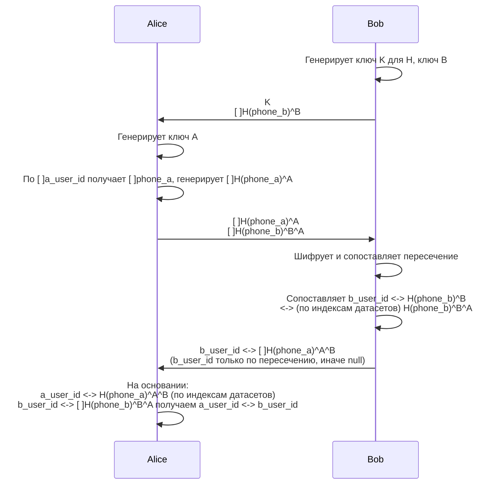

# PSI - Private Set Intersection

Утилита для выполнения криптографического протокола Private Set Intersection с использованием HMAC-SHA256 и ECDH SECP256R1.

## Протокол взаимодействия



## Криптография

- **H**: HMAC-SHA256 (K - ключ для HMAC)
- **^**: коммутативная операция Diffie-Hellman
- **Ключи**: генерируются из ECDH SECP256R1 (P-256)

## Формат данных

Все файлы используют формат TSV (tab-separated values) со сжатием gzip.

Бинарные данные кодируются в hex (шестнадцатеричный формат).

Формат телефонов: E.164 (например, +79991234567)

## Установка

Сначала нужно по инструкции установить go - https://go.dev/doc/install

Затем установить консольную утилиту

```bash
go install github.com/pkositsyn/psi/cmd/psi@latest
```

После установки `psi` будет доступна из любой директории (если `$GOPATH/bin` или `$GOBIN` в `PATH`).

## Использование

### Bob - Step 1

Генерация ключей и шифрование исходных данных.

**Входные данные:**
- Файл `bob_data.tsv`: `phone \t b_user_id`

**Команда:**
```bash
psi bob-step1
```

**Выходные данные:**
- `bob_hmac_key.txt` - ключ K для HMAC (для передачи)
- `bob_ecdh_key.txt` - ключ B для ECDH (приватный, не передавать!)
- `bob_encrypted.tsv.gz` - файл с полями: `index \t H(phone)^B`

**Передать Alice:**
- `bob_hmac_key.txt`
- `bob_encrypted.tsv.gz`

---

### Alice - Step 1

Обработка данных от Bob и генерация своих зашифрованных данных.

**Входные данные:**
- `bob_hmac_key.txt` (от Bob)
- `bob_encrypted.tsv.gz` (от Bob)
- Свой файл `alice_data.tsv`: `phone \t a_user_id`

**Команда:**
```bash
psi alice-step1
```

**Выходные данные:**
- `alice_ecdh_key.txt` - ключ A для ECDH (приватный, не передавать!)
- `bob_encrypted_a.tsv.gz` - файл: `index \t H(phone_b)^B^A`
- `alice_encrypted.tsv.gz` - файл: `index \t H(phone_a)^A \t a_user_id`

**Передать Bob:**
- `bob_encrypted_a.tsv.gz`
- `alice_encrypted.tsv.gz`

---

### Bob - Step 2

Вычисление пересечения и создание маппинга.

**Входные данные:**
- `bob_ecdh_key.txt` (свой из step 1)
- `bob_data.tsv` (оригинальный файл из step 1)
- `alice_encrypted.tsv.gz` (от Alice)
- `bob_encrypted_a.tsv.gz` (от Alice)

**Команда:**
```bash
psi bob-step2
```

**Выходные данные:**
- `bob_final.tsv.gz` - файл: `index \t H(phone_a)^A^B \t b_user_id`
  - `b_user_id` пустой для записей без пересечения

**Передать Alice:**
- `bob_final.tsv.gz`

---

### Alice - Step 2

Создание финального маппинга a_user_id <-> b_user_id.

**Входные данные:**
- `alice_encrypted.tsv.gz` (свой из step 1)
- `bob_final.tsv.gz` (от Bob)

**Команда:**
```bash
psi alice-step2
```

**Выходные данные:**
- `alice_final.tsv` - финальный маппинг: `a_user_id \t b_user_id`
  - `b_user_id` пустой для записей без пересечения

---

### Валидация

Проверка корректности файлов данных:

```bash
psi validate --input файл.tsv.gz
```

## Примеры

### Подготовка тестовых данных

Bob:
```bash
cat > bob_data.tsv << EOF
+79991234567	b_user_001
+79991234568	b_user_002
+79991234569	b_user_003
EOF
```

Alice:
```bash
cat > alice_data.tsv << EOF
+79991234567	a_user_id_123
+79991234570	a_user_id_456
+79991234569	a_user_id_789
EOF
```

### Полный цикл

```bash
psi bob-step1
psi alice-step1
psi bob-step2
psi alice-step2
```

Результат: `alice_final.tsv` содержит маппинг a_user_id <-> b_user_id для пересечения телефонов.

## Лицензия

См. LICENSE
