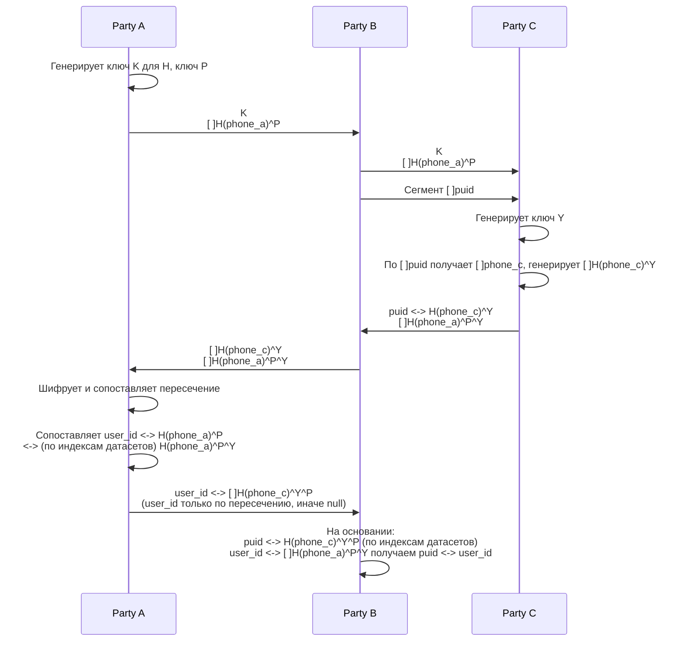

# PSI - Private Set Intersection

Утилита для выполнения криптографического протокола Private Set Intersection с использованием HMAC-SHA256 и ECDH SECP256R1.

## Протокол взаимодействия



## Криптография

- **H**: HMAC-SHA256 (K - ключ для HMAC)
- **^**: коммутативная операция Diffie-Hellman
- **Ключи**: генерируются из ECDH SECP256R1 (P-256)

## Формат данных

Все файлы используют формат TSV (tab-separated values) со сжатием gzip.

Бинарные данные кодируются в base64.

Формат телефонов: E.164 (например, +79991234567)

## Установка

```bash
go mod download
go build -o psi ./cmd/psi
```

## Использование

### Party A - Step 1

Генерация ключей и шифрование исходных данных.

**Входные данные:**
- Файл TSV: `phone \t user_id`

**Команда:**
```bash
./psi partner-step1 \
  --input party_a_data.tsv \
  --out-key party_a_key.txt \
  --out-encrypted party_a_encrypted.tsv.gz
```

**Выходные данные:**
- `party_a_key.txt` - ключи K и P
- `party_a_encrypted.tsv.gz` - файл с полями: `index \t H(phone)^P \t user_id`

**Передать Party B:**
- `party_a_key.txt`
- `party_a_encrypted.tsv.gz`

---

### Party C - Step 1

Обработка данных от Party A и генерация своих зашифрованных данных.

**Входные данные:**
- `party_a_key.txt` (от Party A)
- `party_a_encrypted.tsv.gz` (от Party A)
- Свой файл TSV: `puid \t phone`

**Команда:**
```bash
./psi passport-step1 \
  --in-key party_a_key.txt \
  --in-encrypted party_a_encrypted.tsv.gz \
  --in-puid party_c_data.tsv \
  --out-key party_c_key.txt \
  --out-encrypted-partner party_a_encrypted_y.tsv.gz \
  --out-encrypted-passport party_c_encrypted.tsv.gz
```

**Выходные данные:**
- `party_c_key.txt` - ключ Y
- `party_a_encrypted_y.tsv.gz` - файл: `index \t H(phone_a)^P^Y`
- `party_c_encrypted.tsv.gz` - файл: `index \t puid \t H(phone_c)^Y`

**Передать Party A (через Party B или напрямую):**
- `party_a_encrypted_y.tsv.gz`
- `party_c_encrypted.tsv.gz`

---

### Party A - Step 2

Вычисление пересечения и создание маппинга.

**Входные данные:**
- `party_a_key.txt` (свой из step 1)
- `party_a_encrypted.tsv.gz` (свой из step 1)
- `party_c_encrypted.tsv.gz` (от Party C)
- `party_a_encrypted_y.tsv.gz` (от Party C)

**Команда:**
```bash
./psi partner-step2 \
  --in-key party_a_key.txt \
  --in-original party_a_encrypted.tsv.gz \
  --in-passport-enc party_c_encrypted.tsv.gz \
  --in-partner-enc party_a_encrypted_y.tsv.gz \
  --output party_a_final.tsv.gz
```

**Выходные данные:**
- `party_a_final.tsv.gz` - файл: `index \t H(phone_c)^Y^P \t user_id`
  - `user_id` пустой для записей без пересечения

**Передать Party B:**
- `party_a_final.tsv.gz`

---

### Party C - Step 2

Создание финального маппинга puid <-> user_id.

**Входные данные:**
- `party_c_encrypted.tsv.gz` (свой из step 1)
- `party_a_final.tsv.gz` (от Party A)

**Команда:**
```bash
./psi passport-step2 \
  --in-original party_c_encrypted.tsv.gz \
  --in-partner party_a_final.tsv.gz \
  --output party_c_final.tsv.gz
```

**Выходные данные:**
- `party_c_final.tsv.gz` - финальный маппинг: `puid \t user_id`
  - `user_id` пустой для записей без пересечения

---

### Валидация

Проверка корректности файлов данных:

```bash
./psi validate --input файл.tsv.gz
```

## Примеры

### Подготовка тестовых данных

Party A:
```bash
cat > party_a_data.tsv << EOF
+79991234567	user_001
+79991234568	user_002
+79991234569	user_003
EOF
```

Party C:
```bash
cat > party_c_data.tsv << EOF
puid_123	+79991234567
puid_456	+79991234570
puid_789	+79991234569
EOF
```

### Полный цикл

```bash
./psi partner-step1 --input party_a_data.tsv
./psi passport-step1 --in-key party_a_key.txt --in-encrypted party_a_encrypted.tsv.gz --in-puid party_c_data.tsv
./psi partner-step2 --in-key party_a_key.txt --in-original party_a_encrypted.tsv.gz --in-passport-enc party_c_encrypted.tsv.gz --in-partner-enc party_a_encrypted_y.tsv.gz
./psi passport-step2 --in-original party_c_encrypted.tsv.gz --in-partner party_a_final.tsv.gz
```

Результат: `party_c_final.tsv.gz` содержит маппинг puid <-> user_id для пересечения телефонов.

## Архитектура

```
psi/
├── cmd/
│   ├── psi/
│   │   └── main.go      # точка входа
│   └── root.go          # корневая команда CLI
└── internal/
    ├── commands/        # логика CLI команд
    │   ├── partner_step1.go
    │   ├── partner_step2.go
    │   ├── passport_step1.go
    │   ├── passport_step2.go
    │   └── validate.go
    ├── crypto/          # криптографические примитивы
    │   ├── hmac.go      # HMAC-SHA256
    │   ├── ecdh.go      # ECDH SECP256R1
    │   └── keys.go      # управление ключами
    └── io/              # потоковый ввод-вывод
        └── tsv.go       # TSV + gzip reader/writer
```

## Особенности реализации

- **Потоковая обработка**: файлы читаются и обрабатываются построчно без полной загрузки в память
- **Автоматическое сжатие**: файлы с расширением `.gz` автоматически сжимаются/разжимаются
- **Base64 кодирование**: все бинарные данные кодируются в base64 для безопасной передачи
- **Индексация**: используется для сопоставления записей между файлами (iota-подобная нумерация)

## Лицензия

См. LICENSE
